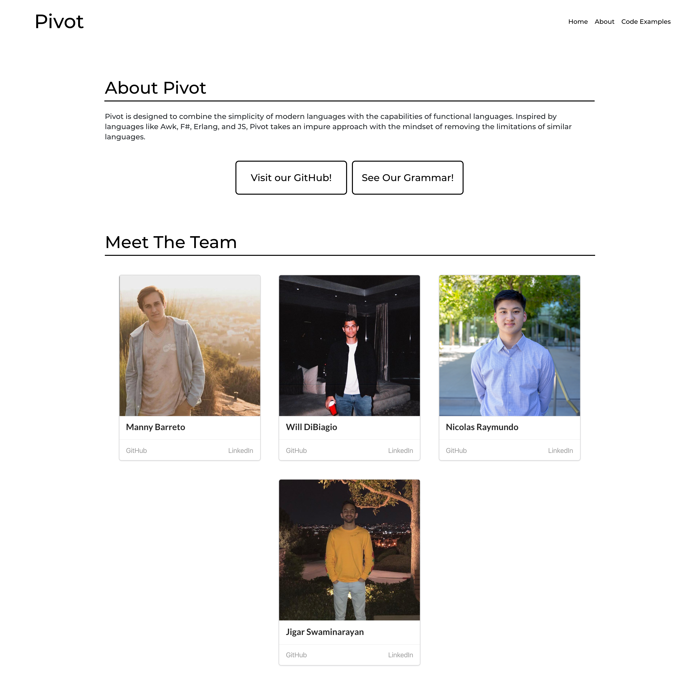

<link href="style.css" rel="stylesheet"></link>

  

<h1 align="center">
  <a href="https://nicoraymundo.com" className="title">
    Pivot
  </a>
</h1>

<strong>A new spin on programming</strong>  

  
  
  

